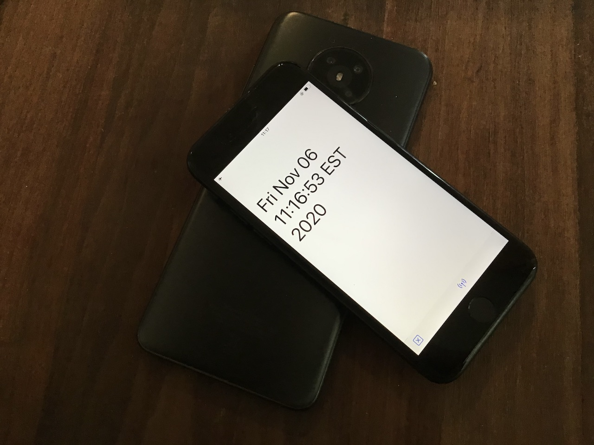

# android-nfc-clock



Simple Android application to demonstrate NFC hardware card emulation (HCE) functionality.

## Description

This is a simple Android application to demonstrate NFC hardware card emulation (HCE) functionality. It does so by using Android's HCE functionality to make a device "broadcast" itself as a new NFC NDEF tag, containing the current date and time, every second.

Does that sound absurd? It should, because it is. This application is meant to serve as a reference implementation and template for more sophisticated applications that want to use Android's NFC/HCE functionality.

## About the code

This application has a hybrid Java and Kotlin code base. That's because all of the actual work listening for NFC tag readers and sending responses is handled by [Qifan Yang](https://github.com/underwindfall/NFCAndroid/)'s `CardService.kt` class which was extracted from the [NFCAndroid](https://github.com/underwindfall/NFCAndroid/) repository.

I am not an experienced Java programmer, let alone Kotlin, so I am taking advantage of the fact that the Android Studio IDE will let me mix and match the two languages seamlessly. Thanks, Google.

My contritbution to this application is distilling the documentation to make a basic HCE-enabled application and the code in [MainActivity.java](#) to update the current time in a timer and demonstrate how to dispatch those updates to the `CardService` class.

The crux of the code involves dispatching an `Intent` to the `CardService` service containing the value of the NDEF message for the underlying HCE service to broadcast:

```
	Context context = this;
        Timer t = new Timer();

        TimerTask task = new TimerTask() {
            @Override
            public void run() {
                Date dt = Calendar.getInstance().getTime();
                Intent intent = new Intent(context, CardService.class);
                intent.putExtra("ndefMessage", dt.toString());
                startService(intent);
            }

        };

        t.scheduleAtFixedRate(task, 0, 1000);   
```

This code doesn't do anything else _by design_. It is meant to be used as a kind of starter-kit for your own more sophisticated applications.

## Configuration files

The following files need to be updated or created in order to create an HCE-enabled application.

### AndroidManifest.xml

At the top-level of your manifest file you will need to add entries enabling the use of the device's NFC functionality:

```
<manifest xmlns:android="http://schemas.android.com/apk/res/android"
    package="org.sfomuseum.nfcclock">

	<uses-permission android:name="android.permission.NFC" />
	<uses-feature android:name="android.hardware.nfc" android:required="true" />

	<!-- the rest of your manifest file here -->
	
</manifest>	
```

You will also need to add the following `service` entry to your `application` definition.

```
	<application
		<service android:name=".CardService" android:exported="true" android:permission="android.permission.BIND_NFC_SERVICE">
 		        <intent-filter>
              			<action android:name="android.nfc.cardemulation.action.HOST_APDU_SERVICE" />

<category android:name="android.intent.category.DEFAULT"/>
            		</intent-filter>
            		<meta-data android:name="android.nfc.cardemulation.host_apdu_service" android:resource="@xml/apduservice" />
       		</service>
		
		<!-- your other application settings here -->

	</application>
```

### apduservice.xml

Did you notice the pointer to `@xml/apduservice` in the example above? That's pointing to a file called `res/xml/apduservice.xml` which should look like this:

```
<host-apdu-service xmlns:android="http://schemas.android.com/apk/res/android" android:description="@string/servicedesc"  android:requireDeviceUnlock="false">
	<aid-group android:description="@string/aiddescription" android:category="other">
        	<aid-filter android:name="D2760000850101"/>
	</aid-group>
</host-apdu-service>
```

The value of the `aid-filter@android:name` property is a [ISO/IEC 7816-5:2004 application identifier](https://www.iso.org/standard/34259.html). This should be unique to your application but I haven't found any documentation describing how to create a new identifier that doesn't cost money yet. Pointers would be welcome.

The `@string/aiddescription` and `@string/servicedesc` properties are pointers to corresponding entries in the `res/values/strings.xml` file. For example:

```
<resources>
    <string name="app_name">NFC Clock</string>
    <string name="aiddescription">NFC Clock</string>
    <string name="servicedesc">NFC Clock</string>
</resources>
```

## Known-knowns and gotchas

The following are notes that I took or copy-pasted from other sources in the process of developing NFC Clock.

* "Current Android implementations turn the NFC controller and the application processor off completely when the screen of the device is turned off. HCE services will therefore not work when the screen is off."

* "What you cannot do with Android HCE ... is communicate with readers that don't send an ISO SELECT (by AID/DF name) command."

* "With regards to emulating a tag on an Android, CoreNFC on iOS only reads NDEF formatted tags so you must make sure there is NDEF formatted data in your emulated tag on Android"

* Unsurprisingly the NFC tag can not be broadcast or read through the screen side of the device, which is too bad since it would be useful to be able to display a target/instructions for a person to scan

* NFC targets on mobile devices are finnicky.

## See also

* https://developer.android.com/guide/topics/connectivity/nfc/nfc
* https://developer.android.com/guide/topics/connectivity/nfc/hce
* https://github.com/underwindfall/NFCAndroid/
* https://github.com/championswimmer/NFC-host-card-emulation-Android